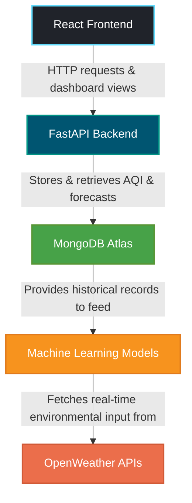

# AirMind AI 🌬️🤖
> An AI-Powered Urban Air Quality Intelligence Platform developed for the ET AI Hackathon.

[](https://fastapi.tiangolo.com)
[](https://react.dev)
[](https://www.mongodb.com/atlas)
[](https://scikit-learn.org)
[](https://openweathermap.org)

---

## 📖 Project Overview
**AirMind AI** is an AI-powered Urban Air Quality Intelligence platform designed to collect real-time environmental data, predict current and future Air Quality Index (AQI) values using Machine Learning, and deliver actionable, personalized health recommendations to citizens. 

By integrating multi-layered meteorological APIs and trained forecasting models, the platform serves as a modern tool for citizens and smart city administrations to monitor pollution, visualize hotspots, and minimize health hazards.

---

## ⚠️ Problem Statement
Rapid urbanization and industrial expansion have led to escalating air pollution in major smart cities. Traditional air quality monitoring systems are expensive, sparse, and lack high-resolution localized forecast predictability. Citizens, especially vulnerable groups like children and the elderly, lack access to real-time preventive advisories, while urban planners lack tools to identify localized pollution hotspots and trends before they escalate.

---

## 💡 Solution
AirMind AI addresses these issues with a cohesive, data-driven approach:
1. **Real-time Environmental Ingestion**: Collecting live weather and pollutant metrics (`PM2.5`, `PM10`, `NO`, `NO2`, `SO2`, `CO`, `O3`, `NH3`) using OpenWeather APIs.
2. **Machine Learning-Driven Forecasts**: Evaluating current AQI and predicting future trends at 24-hour and 72-hour intervals using models trained with `Scikit-learn`.
3. **Actionable Recommendations**: Dynamic health advisories based on the severity of air pollution, empowering citizens with steps like wearing masks, limiting outdoor activities, or using air purifiers.
4. **Smart Dashboard**: A rich React dashboard for interactive maps and time-series charts visualizing pollution hotspots and forecasts.

---

## 🌟 Features
- **Live AQI Monitoring**: Tracks live pollutant values (`PM2.5`, `PM10`, `SO2`, etc.) and weather conditions.
- **Current & Forecast AQI Prediction**:
  - Current AQI estimation using trained ML regressor models.
  - 24-hour AQI Trend Forecast.
  - 72-hour AQI Trend Forecast.
- **Health Recommendation Engine**: Auto-generates tailored health advisories for citizens, children, elderly, and sensitive groups.
- **RESTful Backend APIs**: Modular FastAPI endpoints for data collection, retrieval, and model prediction.
- **Swagger Documentation**: Self-documenting, interactive API sandbox out of the box (`/docs`).
- **Interactive Mapping**: Visualization of pollution hotspots and air quality monitoring sites.
- **MongoDB Atlas Storage**: Secure, scalable NoSQL document storage for spatial-temporal AQI records.

---

## 🏗️ System Architecture



---

## 🔄 Project Workflow
The system processes data end-to-end through the following stages:
1. **Ingestion & Fetching**: The FastAPI server triggers data fetch cycles via REST request or ingestion client, pulling real-time environmental attributes and coordinates from the **OpenWeather APIs**.
2. **Parsing & Storage**: Raw JSON data is validated through Pydantic schemas, parsed, and logged directly into **MongoDB Atlas** under the `aqi_data` collection.
3. **ML Inference Setup**: When a client requests a prediction, the backend geocodes the target location using the OpenWeather Geocoding API, collects active air quality metrics, prepares the input feature vector (handling default zero values for missing elements and formatting categorical variables), and feeds this matrix to the pre-loaded **Scikit-Learn Regressors**.
4. **Multi-Horizon Forecasting**: The system calculates the current AQI estimate and passes this as feedback context to predict the subsequent **24-hour** and **72-hour** AQI trends.
5. **Recommendation & Output**: Based on the predicted AQI level, the backend maps the score to health advisories, formatting and returning the aggregated payload to the **React Dashboard** for UI rendering.

---

## 🏛️ Backend Architecture
The backend application utilizes a clean, service-oriented structure designed around modular layers:
- **Router Layer (`backend/app/api/`)**: Defines HTTP pathways (`/aqi`, `/prediction`, `/`) and maps client parameters to services, validating requests using Pydantic models.
- **Service Layer (`backend/app/services/`)**: Enforces core business logic, handles data aggregation, and coordinates machine learning model execution with local ML scripts.
- **Repository Layer (`backend/app/repositories/`)**: Abstracts low-level database operations using the asynchronous `Motor` MongoDB driver.
- **Database Layer (`backend/app/database/`)**: Handles database connection lifetimes, providing connection setup and teardown within the FastAPI lifespan context.
- **Integration Layer (`backend/app/integrations/`)**: Manages downstream API requests (HTTP get/post) to the OpenWeather APIs with built-in safety limits and timeouts.

---

## 🤖 Machine Learning Pipeline
- **Training**: Regression estimators (Random Forest / Gradient Boosting algorithms) are trained using historical datasets within the `ml/training` folder. Features include regional air pollutant compounds (`PM2.5`, `PM10`, `NOx`, etc.) alongside local variables.
- **Artifact Serialization**: The fitted estimators, input parameters, and feature indices are saved into `.pkl` file collections via `Joblib` inside the `ml/models/` directory for fast restoration.
- **Inference Engine (`ml/predictor.py`)**: Models are loaded into memory exactly once at application startup. Predictor helper methods construct feature frames on-the-fly from live coordinate data, predict multi-timeframe outcomes, and translate raw numbers to health recommendation classes.

---

## 📂 Folder Structure

```directory
airmind-ai/
├── backend/                  # FastAPI Application
│   ├── app/
│   │   ├── api/              # API Endpoint Routes (aqi.py, prediction.py, etc.)
│   │   ├── database/         # MongoDB Client & Connection handlers
│   │   ├── integrations/     # External API Integration Clients (OpenWeather)
│   │   ├── models/           # Pydantic Schemas & MongoDB documents
│   │   ├── repositories/     # Database CRUD access layer
│   │   ├── services/         # Business Logic & Predictor wrappers
│   │   └── utils/            # Path setup & configurations
│   ├── requirements.txt      # Backend Python Dependencies
│   └── README.md
├── frontend/                 # React Application (Vite-powered)
│   ├── src/
│   │   ├── components/       # Reusable UI components
│   │   ├── assets/           # CSS, icons, images
│   │   ├── App.jsx           # Main React component
│   │   └── main.jsx          # React app entry point
│   ├── package.json          # Frontend NodeJS dependencies
│   └── vite.config.js        # Vite configuration
├── ml/                       # Machine Learning Code & Serialized Models
│   ├── models/               # Serialized Pickle models (.pkl)
│   │   ├── aqi_model.pkl
│   │   ├── best_aqi_model.pkl
│   │   ├── best_feature_names.pkl
│   │   ├── feature_names.pkl
│   │   ├── forecast_24_model.pkl
│   │   ├── forecast_72_model.pkl
│   │   ├── forecast_features.pkl
│   │   └── forecast_model.pkl
│   ├── analysis/             # Model training analysis directories
│   ├── datasets/             # Local datasets used for fitting
│   ├── notebooks/            # Notebooks for experiment tracking
│   ├── training/             # Scripts for model fitting and hyperparameter tuning
│   ├── predict.py            # Local CLI interface for prediction
│   ├── predictor.py          # Production prediction engine
│   └── requirements.txt      # ML Package dependencies
├── docs/                     # API and Architecture documentation
│   ├── api-contract.md       # API endpoint contracts
│   ├── architecture.md       # Detailed architectural design
│   └── database-schema.md    # MongoDB database layouts
├── .env.example              # Template for environment variables
├── LICENSE                   # MIT License file
└── README.md                 # Root README file
```

---

## ⚙️ Environment Variables
The application requires three essential variables to manage backend API calls and database connectivity. The backend automatically searches for and loads `.env` values located in the project's root folder at startup.

Create a `.env` file in the root directory:
```env
# MongoDB Credentials
MONGODB_URI=mongodb+srv://<username>:<password>@cluster.mongodb.net/
DATABASE_NAME=airmind_ai

# External API Credentials
OPENWEATHER_API_KEY=your_openweather_api_key_here
```

---

## 🛠️ Error Handling
- **API Boundary Protection**: Custom exceptions generated by the ML pipeline (e.g., `CityNotFoundError`, `ExternalServiceError`, `ModelLoadError`) are trapped at the controller router boundary and mapped to clear REST responses (HTTP `400 Bad Request` or HTTP `500 Internal Server Error`).
- **Graceful Failures**: Network timeouts and unavailable endpoints do not crash the application. Default fallback values are loaded for features missing from the geocoding APIs.
- **Robust Database Recovery**: Database lookup errors are caught asynchronously during connection initialization.

---

## 🔒 Security Considerations
- **Credential Segregation**: System secrets are decoupled from the code and are never committed to version control. An `.env.example` file is provided as a placeholder template.
- **CORS Policies**: Middleware filters ensure cross-origin backend calls are restricted to approved addresses, preventing unauthorized cross-origin requests.
- **Strict Input Validation**: Pydantic schemas enforce type safety, preventing potential command injection or malicious inputs.

---

## 🚀 Installation & Setup

### Prerequisites
- Python 3.10+
- Node.js 18+ & npm
- MongoDB Atlas cluster (or local MongoDB)

### Step 1: Clone the Repository
```bash
git clone https://github.com/ashrithakadarla/airmind-ai.git
cd airmind-ai
```

### Step 2: Set Up Environment Variables
Copy `.env.example` to `.env` in the root folder using one of the following commands:
- **Windows (PowerShell)**:
  ```powershell
  Copy-Item .env.example .env
  ```
- **macOS / Linux (Bash)**:
  ```bash
  cp .env.example .env
  ```
Open the `.env` file and configure it with your active MongoDB URI, database name, and OpenWeather API key.

---

### Step 3: Running the Backend

1. Navigate to the backend directory:
   ```bash
   cd backend
   ```
2. Create and activate a virtual environment:
   - **Windows**:
     ```powershell
     python -m venv venv
     .\venv\Scripts\activate
     ```
   - **macOS / Linux**:
     ```bash
     python3 -m venv venv
     source venv/bin/activate
     ```
3. Install dependencies:
   ```bash
   pip install -r requirements.txt
   ```
4. Start the FastAPI development server:
   ```bash
   python -m uvicorn app.main:app --reload --port 8000
   ```
   *The backend will be running at [http://localhost:8000](http://localhost:8000) and interactive Swagger documentation will be available at [http://localhost:8000/docs](http://localhost:8000/docs).*

---

### Step 4: Running the Frontend

1. Navigate to the frontend directory:
   ```bash
   cd ../frontend
   ```
2. Install dependencies:
   ```bash
   npm install
   ```
3. Run the React development server:
   ```bash
   npm run dev
   ```
   *The frontend dashboard will be running at [http://localhost:5173](http://localhost:5173).*

---

## 🔌 API Endpoints
Interactive Swagger API documentation is available at `http://localhost:8000/docs`. The core routes are defined below:

| Method | Endpoint | Description | Response Example |
| :--- | :--- | :--- | :--- |
| **GET** | `/` | Checks server status | `{"message": "AirMind AI Backend Running"}` |
| **GET** | `/aqi/latest` | Retrieve the latest recorded AQI database record | `{"city": "Hyderabad", "aqi": 128, ...}` |
| **GET** | `/aqi/history` | Retrieve historical AQI data points | `[{"city": "Hyderabad", "aqi": 124, ...}]` |
| **POST** | `/aqi` | Ingests a manual air quality report | `{"message": "AQI data inserted successfully", "id": "..."}` |
| **POST** | `/aqi/collect` | Ingests live data from OpenWeather and stores it | `{"message": "Environmental data collected", "id": "..."}` |
| **GET** | `/prediction/current` | Predicts current AQI and generates recommendation | `{"current_aqi": 124.5, "aqi_category": "Satisfactory", "health_recommendation": "..."}` |
| **GET** | `/prediction/forecast` | Predicts 24h & 72h forecasts for a city | `{"forecast_24_aqi": 132.4, "forecast_72_aqi": 145.2}` |
| **GET** | `/prediction/all` | Fetch complete current and forecast predictions bundle | `{"current_aqi": 124.5, "forecast_24_aqi": 132.4, ...}` |

---

## 👥 Team Members
- **Ashritha Kadarla** — Backend Developer & Integration Lead (Data collection, database modeling, FastAPI endpoints)
- **Varshitha Shetty** — Machine Learning Engineer & Forecaster (Regression models training, predictions, health advice)
- **[Team Member 3]** — Core Contributor / Smart City Data Specialist
- **[Team Member 4]** — Core Contributor / Frontend Mapping Specialist

---

## 🔮 Future Scope
- **Geospatial Heatmap Overlays**: Add Leaflet density heatmaps indicating traffic emissions and industrial zones.
- **Dynamic In-app Notification Delivery**: Alert smart city authorities when projected AQI levels cross hazardous thresholds.
- **Vulnerable Group Profiling**: Customizable user preferences on the React client for targeted medical recommendations.
- **Mobile Companion Apps**: Deploy companion mobile apps (React Native/Flutter) for real-time widgets and background location checks.

---

## 🤝 Contributing
Contributions are welcome! Please follow these steps:
1. **Fork the Repository** to your GitHub account.
2. **Create a Feature Branch** (`git checkout -b feature/NewFeature`).
3. **Commit Your Changes** (`git commit -m 'Add NewFeature'`).
4. **Push to the Branch** (`git push origin feature/NewFeature`).
5. **Open a Pull Request** describing your additions.

---

## 💖 Acknowledgements
- **ET AI Hackathon Organizers** for the opportunity.
- **OpenWeather Map** for the real-time environmental geocoding APIs.
- **FastAPI and Vite Communities** for providing fast and reliable tooling.

---

## 📄 License
This project is licensed under the **MIT License** - see the [LICENSE](file:///c:/Users/kadar/OneDrive/ドキュメント/Projects/airmind-ai/LICENSE) file for details.

Copyright © 2026 Ashritha Kadarla.