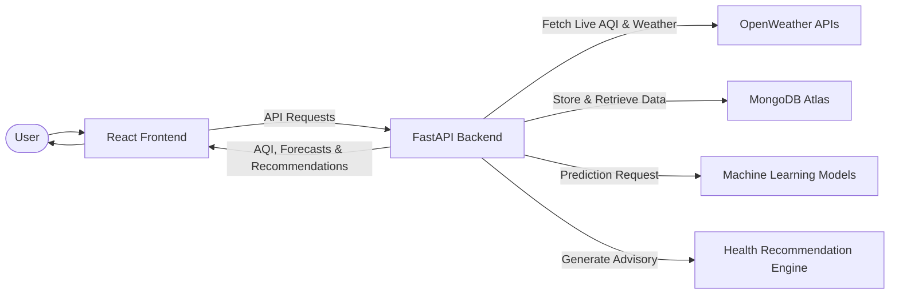

# AirMind AI

> AI-Powered Urban Air Quality Intelligence Platform for Smart City Intervention
> Developed for ET AI Hackathon 2026 – Problem Statement 5

[](https://react.dev)
[](https://fastapi.tiangolo.com)
[](https://www.python.org)
[](https://www.mongodb.com)
[](https://scikit-learn.org)
[](LICENSE)

---

## 📖 Project Overview

**AirMind AI** is an AI-powered Urban Air Quality Intelligence platform designed for **Smart City Intervention**. It combines real-time environmental monitoring, AI-driven AQI prediction, geospatial visualization, and health intelligence to help both citizens and city administrators make proactive decisions.

The platform integrates live weather and air quality data, predicts current and future AQI (24-hour and 72-hour forecasts), visualizes pollution hotspots on interactive maps, analyzes pollutant trends, and generates health recommendations based on predicted air quality.

By transforming environmental data into actionable intelligence, AirMind AI moves beyond traditional monitoring dashboards toward evidence-based urban decision making.

---

## Why AirMind AI?

Air pollution has become one of the most critical challenges facing modern cities. While monitoring infrastructure has improved, most existing systems remain **reactive**—they report pollution after it occurs but provide limited support for proactive decision-making.

AirMind AI was built to bridge this gap by transforming environmental data into actionable intelligence for both citizens and smart city authorities.

- **Real-Time Environmental Intelligence**: Continuously monitors live AQI, pollutant concentrations, and weather conditions to provide an accurate picture of current air quality.
- **AI-Powered Forecasting**: Predicts current AQI and forecasts air quality for the next **24 hours** and **72 hours**, enabling proactive planning instead of reactive response.
- **Geospatial Pollution Awareness**: Visualizes pollution hotspots on an interactive map, helping users quickly identify high-risk locations across a city.
- **Public Health Support**: Converts complex environmental data into easy-to-understand health recommendations that help citizens reduce exposure to harmful pollution.
- **Smart City Decision Support**: Provides a unified dashboard that assists administrators in monitoring pollution trends, understanding environmental conditions, and supporting evidence-based urban planning.

---

## ⚠️ Problem Statement

Air pollution has evolved into one of the most pressing urban challenges in India, affecting public health, environmental sustainability, and overall quality of life. Although cities generate large volumes of air quality and meteorological data through monitoring stations, most existing systems remain limited to displaying current conditions, offering little support for proactive decision-making.

City administrators require more than static dashboards—they need predictive intelligence, geospatial insights, and actionable recommendations to identify pollution hotspots, anticipate deteriorating air quality, and plan timely interventions. At the same time, citizens need simple, reliable health advisories that help them reduce exposure to harmful pollutants.

The challenge is to transform fragmented environmental data into an intelligent platform that supports smarter urban planning, improves public awareness, and enables evidence-based interventions for healthier cities.

---

## 💡 Solution

AirMind AI transforms environmental monitoring into an intelligent decision-support platform by combining real-time data collection, AI-driven prediction, geospatial visualization, and public health intelligence.

1. **Real-Time Environmental Intelligence**
   - Collects live air quality and weather data using OpenWeather APIs, including pollutants (`PM2.5`, `PM10`, `NO`, `NO₂`, `SO₂`, `CO`, `O₃`, `NH₃`) along with meteorological parameters such as temperature, humidity, and wind conditions.

2. **AI-Powered AQI Prediction**
   - Utilizes Machine Learning models built with **Scikit-learn** to estimate the current AQI and forecast air quality for the next **24 hours** and **72 hours**, enabling proactive environmental monitoring.

3. **Geospatial Pollution Visualization**
   - Presents interactive maps, pollution hotspots, historical AQI trends, and pollutant analytics to help users understand spatial and temporal variations in air quality.

4. **Health Intelligence**
   - Generates AQI-based health recommendations that provide practical guidance for citizens, helping them minimize exposure to harmful pollutants during poor air quality conditions.

5. **Smart City Dashboard**
   - Integrates monitoring, prediction, analytics, and visualization into a unified dashboard that supports data-driven environmental awareness and smarter urban decision-making.

---

## Features

- **Live Environmental Monitoring** – Collects real-time AQI, pollutant levels, and weather data using OpenWeather APIs.
- **AI-Powered AQI Prediction** – Predicts current AQI along with **24-hour** and **72-hour** forecasts using Machine Learning.
- **Geospatial Air Quality Visualization** – Interactive maps with pollution hotspots for better spatial awareness.
- **Historical Analytics** – Visualizes AQI history, pollutant trends, and forecast timelines through interactive charts.
- **Smart Health Recommendations** – Generates AQI-based health advisories to help citizens make informed decisions.
- **FastAPI Backend & MongoDB** – RESTful APIs with scalable data storage and interactive Swagger documentation.
---

## System Architecture

### Overview Diagram

```text
                 OpenWeather APIs
                        │
                        ▼
            Data Collection & Processing
                        │
                        ▼
                 FastAPI Backend
          ┌─────────────┼─────────────┐
          ▼             ▼             ▼
    MongoDB Atlas   ML Models   Health Engine
          │             │             │
          └─────────────┴─────────────┘
                        │
                        ▼
                React Dashboard
                        │
                        ▼
                     End User
```

### High-Level Data Flow



---

## 🛠️ Technology Stack

| Category | Technologies |
| :--- | :--- |
| **Frontend** | React, Vite, React Router, Recharts, React Leaflet, CSS |
| **Backend** | FastAPI, Uvicorn, Pydantic |
| **Database** | MongoDB Atlas, Motor |
| **Machine Learning** | Scikit-learn, Joblib, Pandas, NumPy |
| **External APIs** | OpenWeather APIs (Air Pollution, Weather, Geocoding) |
| **Development Tools** | Git, GitHub, Swagger UI |

---

## 🔄 Project Workflow

AirMind AI processes environmental data through the following workflow:

1. **Data Collection** – The backend fetches real-time air quality and weather information from the OpenWeather APIs based on the selected city.
2. **Data Storage** – Environmental data is processed and stored in MongoDB Atlas, creating a historical repository for analysis and prediction.
3. **AI Prediction** – Machine Learning models estimate the current AQI and generate **24-hour** and **72-hour** air quality forecasts.
4. **Health Intelligence** – Based on the predicted AQI category, the system generates personalized health recommendations for citizens.
5. **Visualization** – The React dashboard displays live AQI, AI predictions, pollutant trends, historical analytics, interactive maps, and health advisories through intuitive visualizations.

---

## 📸 Screenshots

| Home Dashboard | Prediction Dashboard |
| :---: | :---: |
|  |  |

| AQI Analytics | Interactive Map |
| :---: | :---: |
|  |  |

---

## 📂 Project Structure

```text
airmind-ai/
│
├── backend/      # FastAPI backend & APIs
├── frontend/     # React dashboard
├── ml/           # Machine Learning models & prediction
├── docs/         # Project documentation
├── .env.example
├── LICENSE
└── README.md
```

---

## ⚙️ Environment Variables

Create a `.env` file in the project root using the following template:

```env
# MongoDB
MONGODB_URI=your_mongodb_connection_string
DATABASE_NAME=airmind_ai

# OpenWeather API
OPENWEATHER_API_KEY=your_openweather_api_key
```

Alternatively, copy the provided `.env.example` file:

```bash
cp .env.example .env
```

---

## Installation & Setup

### Prerequisites

- Python 3.10+
- Node.js 18+
- MongoDB Atlas
- OpenWeather API Key

### 1. Clone the Repository

```bash
git clone https://github.com/ashrithakadarla/airmind-ai.git
cd airmind-ai
```

### 2. Configure Environment Variables

Create a `.env` file in the project root.

```env
MONGODB_URI=your_mongodb_uri
DATABASE_NAME=airmind_ai
OPENWEATHER_API_KEY=your_openweather_api_key
```

### 3. Run the Backend

```bash
cd backend

python -m venv venv

# Windows
venv\Scripts\activate

# Linux/macOS
source venv/bin/activate

pip install -r requirements.txt

uvicorn app.main:app --reload
```

Backend will be available at:

- API: http://localhost:8000
- Swagger Docs: http://localhost:8000/docs

### 4. Run the Frontend

Open another terminal.

```bash
cd frontend

npm install

npm run dev
```

Frontend will be available at:

http://localhost:5173

---

For detailed setup instructions of each module:

- 📁 `backend/README.md`
- 📁 `frontend/README.md`
- 📁 `ml/README.md`

---

## 🔌 API Overview

The backend exposes RESTful APIs built with FastAPI for data collection, AQI retrieval, prediction, and dashboard visualization.

Interactive API documentation is available via Swagger UI:

http://localhost:8000/docs

| Method | Endpoint | Description |
|:------:|----------|-------------|
| **POST** | `/aqi/collect/{city}` | Fetch and store the latest AQI and weather data for a city |
| **GET** | `/aqi/latest` | Retrieve the latest AQI data |
| **GET** | `/aqi/history` | Retrieve historical AQI records |
| **GET** | `/prediction/current` | Predict the current AQI |
| **GET** | `/prediction/forecast` | Generate 24-hour and 72-hour AQI forecasts |
| **GET** | `/prediction/all` | Return AQI, forecasts, pollutant data, and health advisory |

---

## 🔮 Future Enhancements

Although AirMind AI is currently focused on city-level air quality monitoring and prediction, the platform can be extended with several smart-city capabilities:

- Hyperlocal (ward-level) AQI forecasting
- Pollution source attribution using geospatial datasets
- Multi-city comparative intelligence dashboard
- Real-time IoT sensor integration (CAAQMS)
- Satellite imagery and remote sensing integration
- Traffic-aware pollution forecasting
- Personalized multilingual health advisories
- Smart alert and notification system

---

## 👥 Team Members

- **Ashritha Kadarla** — **Team Lead • Backend Developer & Integration Lead**  
  Responsible for backend architecture, FastAPI API development, MongoDB integration, database modeling, project integration, and team coordination.

- **Ishwika Bitla** — **Data Collection & API Integration**  
  Responsible for integrating environmental APIs, collecting AQI and weather data, preprocessing datasets, and managing the data ingestion pipeline.

- **Varshitha Shenishetty** — **Machine Learning & Prediction**  
  Responsible for feature engineering, training AQI prediction models, forecasting future AQI, and generating health recommendations.

- **Sri Harshitha Chapala** — **Frontend & Visualization**  
  Responsible for developing the React dashboard, interactive maps, data visualizations, charts, and frontend integration.

---

## 🤝 Team Contributions

AirMind AI was developed collaboratively for the **ET AI Hackathon 2026**.

Each team member was responsible for a core module:

- **Data Collection & API Integration**
- **Backend & Database**
- **Machine Learning & Prediction**
- **Frontend & Visualization**

These modules were collaboratively integrated into a unified AI-powered urban air quality intelligence platform.

---

## 💖 Acknowledgements

Special thanks to:

- **ET AI Hackathon Organizers** for providing the opportunity and platform.
- **OpenWeather** for real-time weather, air quality, and geocoding APIs.
- **FastAPI** for enabling a high-performance backend framework.
- **React & Vite** for powering the frontend development experience.
- **MongoDB Atlas** for cloud database services.
- **Scikit-learn** for machine learning tools and model development.
- Our teammates for their collaboration and contributions throughout the project.

---

## 📄 License

This project is licensed under the **MIT License**. See the [LICENSE](LICENSE) file for more information.

---

<div align="center">

**Built with ❤️ for the ET AI Hackathon 2026**

*Powered by React • FastAPI • Machine Learning • MongoDB*

</div>