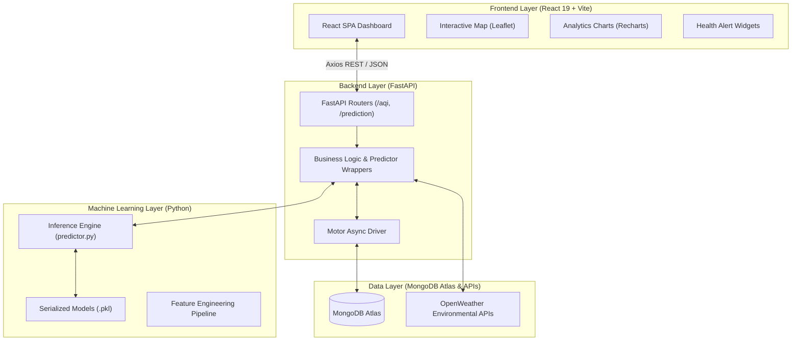
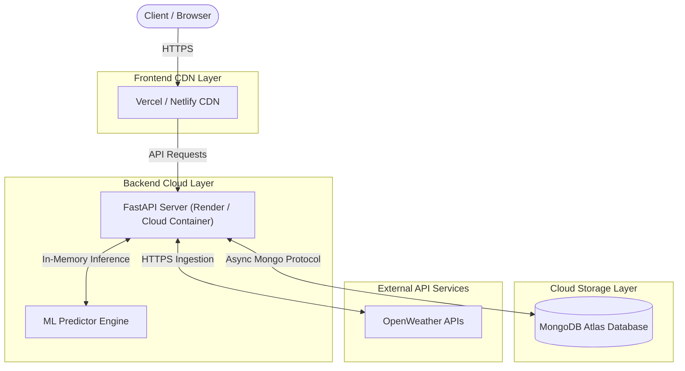

# AirMind AI — System Architecture Specification

> Technical architecture document for AirMind AI: AI-Powered Urban Air Quality Intelligence Platform. Developed for the ET AI Hackathon 2026.

---

## 1. System Overview

### Problem Statement
Rapid urbanization and industrial growth have escalated ambient air pollution in major smart cities. Traditional monitoring infrastructure remains **reactive**—it displays historical or current pollution levels after exposure occurs but provides minimal support for proactive decision-making. Furthermore, citizens and city planners lack high-resolution predictive forecasts and tailored public health advisories.

### Purpose of AirMind AI
**AirMind AI** is designed as a proactive, AI-driven Urban Air Quality Intelligence platform. It bridges the gap between raw environmental monitoring and actionable decision-making by:
- Ingesting live pollutant concentrations (`PM2.5`, `PM10`, `NO2`, `SO2`, `CO`, `O3`) and meteorological metrics.
- Serving machine learning-based current AQI estimates and multi-horizon forecasts (24-hour and 72-hour trends).
- Visualizing localized pollution hotspots on interactive Leaflet maps and Recharts trendlines.
- Auto-generating targeted public health advisories for general citizens and vulnerable demographics.

### High-Level Workflow
```text
Live Data Collection ──► Data Processing ──► ML Feature Engineering & Prediction ──► FastAPI REST Serving ──► React Dashboard Visualization
```

---

## 2. High-Level Architecture

The platform follows a decoupled, service-oriented modular architecture separating data ingestion, machine learning inference, API delivery, and client-side rendering.

```text
               Data Sources (OpenWeather APIs / Historical Datasets)
                                       │
                                       ▼
                             Data Processing Layer
                                       │
                                       ▼
                            Machine Learning Layer
                            (Scikit-Learn / Models)
                                       │
                                       ▼
                             FastAPI Backend Layer
                           (REST APIs & MongoDB)
                                       │
                                       ▼
                            React Frontend Dashboard
                                       │
                                       ▼
                                   End Users
```

### Component Responsibilities

| Layer | Primary Responsibility |
| :--- | :--- |
| **Data Sources** | External APIs providing live ambient pollutant levels, weather metrics, and geocoding coordinates. |
| **Data Processing Layer** | Data validation, Pydantic schema parsing, feature alignment, and missing value imputation. |
| **Machine Learning Layer** | Pre-trained regressor models executing real-time AQI estimation and 24h/72h forecasting. |
| **FastAPI Backend** | High-performance ASGI REST server managing database persistence (MongoDB Atlas) and routing. |
| **React Frontend** | Client-side SPA rendering interactive maps, analytics charts, prediction cards, and alerts. |
| **End Users** | Citizens, vulnerable groups, and smart city administrators consuming real-time environmental insights. |

---

## 3. Architecture Components



---

### 🖥️ Frontend Layer
- **Components**: React 19 SPA, Vite build engine, React Router DOM, React Leaflet geospatial map layer, Recharts time-series wrappers, and Context API (`CityContext`).
- **Key Modules**:
  - `Navbar`: Global city search and navigation.
  - `AQICard`: Real-time AQI gauge and international severity category.
  - `AQIMap`: Interactive station markers and hotspot visualizer.
  - `Charts`: Historical AQI and pollutant breakdown trendlines (`PM2.5`, `PM10`, `NO2`, etc.).
  - `PredictionCards`: Multi-horizon 24h and 72h forecast displays.
  - `AlertCard`: Tailored health advisories based on pollution severity.
- **Responsibilities**: User interaction, client-side routing, state synchronization, and data visualization.

---

### ⚡ Backend Layer
- **Components**: FastAPI, Uvicorn ASGI server, Pydantic runtime validation schemas, Motor asynchronous MongoDB driver, and HTTP client integrations.
- **Key Services**:
  - `AQIRouter`: Endpoints for fetching latest AQI and historical series (`/aqi/latest`, `/aqi/history`).
  - `PredictionRouter`: Inference gateway for current and multi-horizon forecasts (`/prediction/current`, `/prediction/forecast`).
  - `IntegrationService`: OpenWeather API data collection and geocoding handlers.
- **Responsibilities**: Endpoint management, business logic execution, database interactions, request validation, and ML model integration.

---

### 🧠 Machine Learning Layer
- **Components**: Python, Scikit-learn, Pandas, NumPy, and Joblib serialization.
- **Algorithms Evaluated & Deployed**:
  - **Random Forest Regressor**: Primary estimator for current AQI estimation.
  - **Gradient Boosting Regressor**: Temporal trend forecaster for 24h and 72h projections.
  - *Candidate Algorithms*: XGBoost, LightGBM, and Time-Series Regressors.
- **Responsibilities**: Data preprocessing, feature matrix alignment, model training, artifact serialization, and production inference serving via `predictor.py`.

---

### 🗄️ Data Layer
- **Components**: MongoDB Atlas cloud cluster, OpenWeather API ingestion feed, and serialized pickle artifacts.
- **Core Database Collections**:
  - `aqi`: Structured historical records of AQI measurements, city names, coordinates, and timestamps.
  - `environmental_data`: Raw snapshot payloads storing individual pollutant concentrations (`PM2.5`, `PM10`, `NO2`, `SO2`, `CO`, `O3`, `NH3`) and weather attributes.
- **Key Model Feature Attributes**:
  - `PM2.5`, `PM10`, `NO2`, `SO2`, `CO`, `O3`, `NH3` (Air pollutants)
  - `Temperature`, `Humidity`, `Wind Speed` (Meteorological features)

---

## 4. Data Flow Architecture

The end-to-end data lifecycle moves through seven distinct stages:

```text
1. Data Collection ──► 2. Cleaning ──► 3. Feature Extraction ──► 4. ML Inference ──► 5. API Response ──► 6. Frontend Render ──► 7. User Action
```

1. **AQI & Weather Data Collection**: FastAPI integration client fetches live air pollutant readings and meteorological attributes from OpenWeather APIs for a user-selected city or coordinate set.
2. **Data Cleaning & Preprocessing**: Raw JSON responses are validated via Pydantic schemas, replacing missing or zero values with domain fallback defaults.
3. **Feature Extraction**: Features (`PM2.5`, `PM10`, `NO2`, `SO2`, `CO`, `O3`, temperature, humidity) are extracted and arranged into numpy feature arrays.
4. **ML Model Prediction**: The backend predictor deserializes pre-trained Scikit-learn estimators to compute current AQI and 24h/72h forecast values.
5. **Backend API Response Generation**: The service layer bundles current AQI, forecasts, pollutant breakdowns, and health recommendation strings into a unified JSON API payload.
6. **Frontend Visualization**: The React client receives the payload via Axios, updates `CityContext`, and re-renders the dashboard widgets, Recharts line graphs, and Leaflet map markers.
7. **User Insights & Alerts**: End users view real-time AQI levels, forecast trends, and targeted health advisories (e.g., outdoor activity restrictions).

---

## 5. ML Pipeline Architecture

```text
Data Collection
       ↓
 Clean Data
       ↓
Feature Engineering
       ↓
 Model Training
       ↓
Model Evaluation
       ↓
Model Deployment
       ↓
AQI Prediction API
```

| Pipeline Stage | Description |
| :--- | :--- |
| **Data Collection** | Aggregates historical ambient air quality and meteorological records into tabular training sets. |
| **Data Cleaning** | Handles outliers, aligns timestamps, normalizes distributions, and imputes missing fields. |
| **Feature Engineering** | Generates polynomial features, lag attributes, and rolling temporal averages for forecasting. |
| **Model Training** | Fits Random Forest and Gradient Boosting regressors using target AQI ground truths. |
| **Model Evaluation** | Validates regression metrics against unseen test splits evaluating MAE, RMSE, and $R^2$ scores. |
| **Model Deployment** | Serializes trained model estimators to `.pkl` files via Joblib for high-speed restoration. |
| **AQI Prediction API** | Exposes memory-loaded predictor inference methods through FastAPI endpoints. |

---

## 6. Deployment Architecture

The production deployment strategy isolates frontend static assets, backend API servers, and database persistence layers across cloud providers:



- **Frontend Hosting**: Deployed on **Vercel** or **Netlify** CDN for global edge caching and instant static asset delivery.
- **Backend Hosting**: Containerized FastAPI application running on **Render** or **AWS App Runner** / **GCP Cloud Run**.
- **ML Serving**: Models are serialized as light binary pickle files (`.pkl`) and loaded directly into the FastAPI server memory space at startup for zero-latency inference.
- **Database Storage**: Hosted on **MongoDB Atlas** managed cloud clusters for secure, scalable spatial-temporal data persistence.

---

<div align="center">

**AirMind AI System Architecture Specification • ET AI Hackathon 2026**

*React 19 • FastAPI • Python 3.10+ • Scikit-Learn • MongoDB Atlas*

</div>