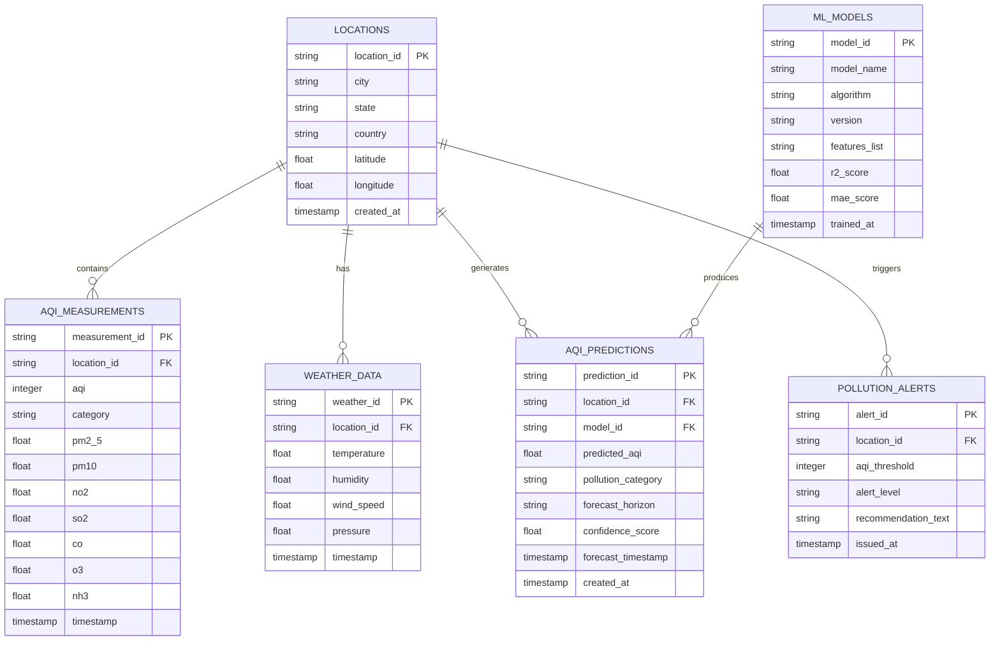

# AirMind AI — Database Schema Specification

> Database architecture, entity relationship models, and data schema specifications for the AirMind AI Urban Air Quality Intelligence Platform. Developed for the ET AI Hackathon 2026.

---

## 1. Database Overview

### Purpose of Database
The **AirMind AI Database** serves as the primary persistence engine for spatial-temporal environmental monitoring records, historical pollutant analytics, meteorological parameters, machine learning forecast outputs, and public health advisories.

### Database Architecture & Role
The database acts as the single source of truth connecting live ingestion pipelines, machine learning predictor engines, REST API endpoints, and the React frontend dashboard.

- **Primary Storage**: Relational Schema (PostgreSQL with PostGIS extensions) / Scalable Document Store (MongoDB Atlas) for high-performance spatial-temporal queries.
- **Role in Architecture**:
  - Persists real-time ambient pollutant measurements and weather attributes.
  - Stores historical time-series data required for model training and trend analytics.
  - Caches machine learning prediction outputs (current AQI estimation, 24h forecast, 72h forecast).
  - Logs public health alerts and advisory notifications for swift client retrieval.

### Data Stored
- 📍 **Location Data**: City names, states, countries, and geographic coordinates (`latitude`, `longitude`).
- 🧪 **AQI & Pollutant Measurements**: Calculated AQI score, severity band, and individual gas concentrations (`PM2.5`, `PM10`, `NO2`, `SO2`, `CO`, `O3`, `NH3`).
- 🌤️ **Weather Information**: Temperature, atmospheric pressure, relative humidity, and wind speed.
- 🤖 **ML Predictions**: Estimated current AQI, 24-hour forecast, 72-hour forecast, confidence scores, and algorithm metadata.
- ⚠️ **Pollution Alerts**: Severity risk levels (e.g., `WARNING`, `HAZARDOUS`) and population-specific health advisories.

---

## 2. Database Architecture & Data Flow

```text
Data Sources (OpenWeather APIs / Sensors)
                   │
                   ▼
         Data Processing Layer
  (Pydantic Validation & Normalization)
                   │
                   ▼
          Database Persistence
     (PostgreSQL / MongoDB Atlas)
                   │
                   ▼
          FastAPI Backend Service
     (REST APIs & Router Services)
                   │
                   ▼
          React Frontend Dashboard
    (Leaflet Maps & Recharts Analytics)
```

### Data Lifecycle
1. **Data Ingestion**: Live environmental feeds are pulled from OpenWeather APIs or low-cost CAAQMS sensors.
2. **Processing & Normalization**: The data processing layer validates JSON schemas, converts units, and formats timestamp attributes.
3. **Database Persistence**: Parsed records are written to the database across relational tables (`LOCATIONS`, `AQI_MEASUREMENTS`, `WEATHER_DATA`).
4. **Prediction & Caching**: Machine learning inference scripts execute forecasts and store results in `AQI_PREDICTIONS` linked to `ML_MODELS`.
5. **API & Dashboard Delivery**: FastAPI queries indexed collections/tables and serves clean JSON responses to the React client for UI map and chart rendering.

---

## 3. Entity Relationship Overview



---

## 4. Table Schema Specifications

### 1. `LOCATIONS`
Stores spatial information and geographic metadata for monitored cities and stations.

| Field Name | Data Type | Constraints | Description | Example |
| :--- | :--- | :--- | :--- | :--- |
| `location_id` | `VARCHAR(36)` | `PRIMARY KEY` | Unique location identifier | `"loc_hyd_01"` |
| `city` | `VARCHAR(100)` | `NOT NULL` | City name | `"Hyderabad"` |
| `state` | `VARCHAR(100)` | `NULLABLE` | State or region name | `"Telangana"` |
| `country` | `VARCHAR(50)` | `NOT NULL` | Country ISO code or name | `"India"` |
| `latitude` | `FLOAT` | `NOT NULL` | Latitude coordinate | `17.3850` |
| `longitude` | `FLOAT` | `NOT NULL` | Longitude coordinate | `78.4867` |
| `created_at` | `TIMESTAMP` | `DEFAULT NOW()` | Record creation timestamp | `"2026-07-23T00:00:00Z"` |

---

### 2. `AQI_MEASUREMENTS`
Stores ambient air quality index scores and concentrations of major pollutants.

| Field Name | Data Type | Constraints | Description | Example |
| :--- | :--- | :--- | :--- | :--- |
| `measurement_id` | `VARCHAR(36)` | `PRIMARY KEY` | Unique measurement identifier | `"meas_98234"` |
| `location_id` | `VARCHAR(36)` | `FOREIGN KEY` | Reference to `LOCATIONS.location_id` | `"loc_hyd_01"` |
| `aqi` | `INTEGER` | `NOT NULL` | Calculated Air Quality Index | `128` |
| `category` | `VARCHAR(50)` | `NOT NULL` | Health severity category | `"Moderate"` |
| `pm2_5` | `FLOAT` | `NOT NULL` | $\text{PM}_{2.5}$ concentration ($\mu g/m^3$) | `42.5` |
| `pm10` | `FLOAT` | `NOT NULL` | $\text{PM}_{10}$ concentration ($\mu g/m^3$) | `85.0` |
| `no2` | `FLOAT` | `NULLABLE` | $\text{NO}_2$ concentration ($\mu g/m^3$) | `24.3` |
| `so2` | `FLOAT` | `NULLABLE` | $\text{SO}_2$ concentration ($\mu g/m^3$) | `12.1` |
| `co` | `FLOAT` | `NULLABLE` | $\text{CO}$ concentration ($\mu g/m^3$) | `0.8` |
| `o3` | `FLOAT` | `NULLABLE` | $\text{O}_3$ concentration ($\mu g/m^3$) | `35.6` |
| `nh3` | `FLOAT` | `NULLABLE` | $\text{NH}_3$ concentration ($\mu g/m^3$) | `4.2` |
| `timestamp` | `TIMESTAMP` | `NOT NULL` | Time of measurement observation | `"2026-07-23T00:00:00Z"` |

---

### 3. `WEATHER_DATA`
Stores meteorological parameters that influence pollutant dispersion and local air quality.

| Field Name | Data Type | Constraints | Description | Example |
| :--- | :--- | :--- | :--- | :--- |
| `weather_id` | `VARCHAR(36)` | `PRIMARY KEY` | Unique weather observation ID | `"wx_88123"` |
| `location_id` | `VARCHAR(36)` | `FOREIGN KEY` | Reference to `LOCATIONS.location_id` | `"loc_hyd_01"` |
| `temperature` | `FLOAT` | `NOT NULL` | Temperature in Celsius ($^\circ\text{C}$) | `29.5` |
| `humidity` | `FLOAT` | `NOT NULL` | Relative humidity percentage ($\%$) | `62.0` |
| `wind_speed` | `FLOAT` | `NOT NULL` | Wind speed ($m/s$) | `4.2` |
| `pressure` | `FLOAT` | `NULLABLE` | Atmospheric pressure ($hPa$) | `1012.5` |
| `timestamp` | `TIMESTAMP` | `NOT NULL` | Time of meteorological recording | `"2026-07-23T00:00:00Z"` |

---

### 4. `AQI_PREDICTIONS`
Stores model inference results, multi-horizon trend forecasts, and confidence metrics.

| Field Name | Data Type | Constraints | Description | Example |
| :--- | :--- | :--- | :--- | :--- |
| `prediction_id` | `VARCHAR(36)` | `PRIMARY KEY` | Unique prediction identifier | `"pred_55412"` |
| `location_id` | `VARCHAR(36)` | `FOREIGN KEY` | Reference to `LOCATIONS.location_id` | `"loc_hyd_01"` |
| `model_id` | `VARCHAR(36)` | `FOREIGN KEY` | Reference to `ML_MODELS.model_id` | `"model_rf_01"` |
| `predicted_aqi` | `FLOAT` | `NOT NULL` | Model-estimated AQI score | `135.4` |
| `pollution_category`| `VARCHAR(50)` | `NOT NULL` | Predicted health severity category | `"Unhealthy for Sensitive Groups"` |
| `forecast_horizon` | `VARCHAR(10)` | `NOT NULL` | Forecast timeframe (`"24h"` or `"72h"`) | `"24h"` |
| `confidence_score` | `FLOAT` | `NOT NULL` | Statistical confidence metric ($0.0 - 1.0$) | `0.91` |
| `forecast_timestamp`| `TIMESTAMP`| `NOT NULL` | Projected future timestamp | `"2026-07-24T00:00:00Z"` |
| `created_at` | `TIMESTAMP` | `DEFAULT NOW()` | Execution timestamp | `"2026-07-23T00:00:00Z"` |

---

### 5. `ML_MODELS`
Tracks machine learning estimator versions, training metadata, algorithms, and performance metrics.

| Field Name | Data Type | Constraints | Description | Example |
| :--- | :--- | :--- | :--- | :--- |
| `model_id` | `VARCHAR(36)` | `PRIMARY KEY` | Unique model registration ID | `"model_rf_01"` |
| `model_name` | `VARCHAR(100)` | `NOT NULL` | Descriptive model identifier | `"RandomForest_AQI_v1"` |
| `algorithm` | `VARCHAR(100)` | `NOT NULL` | Machine Learning algorithm used | `"Random Forest Regressor"` |
| `version` | `VARCHAR(20)` | `NOT NULL` | Model release version | `"1.0.0"` |
| `features_list` | `TEXT` | `NOT NULL` | Feature names array (JSON string) | `"[\"pm2_5\", \"pm10\", \"temp\"]"` |
| `r2_score` | `FLOAT` | `NOT NULL` | Test set $R^2$ accuracy score | `0.94` |
| `mae_score` | `FLOAT` | `NOT NULL` | Mean Absolute Error | `4.12` |
| `trained_at` | `TIMESTAMP` | `NOT NULL` | Model fitting completion time | `"2026-07-22T18:00:00Z"` |

---

### 6. `POLLUTION_ALERTS`
Stores active pollution warnings, severity thresholds, and group-specific health advisories.

| Field Name | Data Type | Constraints | Description | Example |
| :--- | :--- | :--- | :--- | :--- |
| `alert_id` | `VARCHAR(36)` | `PRIMARY KEY` | Unique alert identifier | `"alt_77123"` |
| `location_id` | `VARCHAR(36)` | `FOREIGN KEY` | Reference to `LOCATIONS.location_id` | `"loc_hyd_01"` |
| `aqi_threshold` | `INTEGER` | `NOT NULL` | Triggering AQI lower bound | `100` |
| `alert_level` | `VARCHAR(20)` | `NOT NULL` | Severity status (`"WARNING"`, `"HAZARDOUS"`) | `"WARNING"` |
| `recommendation_text`| `TEXT` | `NOT NULL` | Actionable health recommendation | `"Air quality is moderate..."` |
| `issued_at` | `TIMESTAMP` | `DEFAULT NOW()` | Timestamp of alert issuance | `"2026-07-23T00:00:00Z"` |

---

## 5. Database Security & Query Optimization

### Indexing Strategies
To ensure low-latency API response times (< 50ms) across historical charts and spatial queries:

1. **Spatial Indexes**:
   - `CREATE INDEX idx_locations_coords ON LOCATIONS(latitude, longitude);`
   - Enables fast geospatial bounding box queries for Leaflet map markers.

2. **Time-Series Indexing**:
   - `CREATE INDEX idx_aqi_loc_time ON AQI_MEASUREMENTS(location_id, timestamp DESC);`
   - Optimizes time-series queries for historical trend charts (`/aqi/history`).

3. **Prediction Lookups**:
   - `CREATE INDEX idx_predictions_loc_horizon ON AQI_PREDICTIONS(location_id, forecast_horizon, created_at DESC);`
   - Ensures rapid retrieval of the latest 24h/72h forecast predictions for dashboard widgets.

### Data Integrity & Constraints
- **Foreign Key Constraints**: Enforces referential integrity across `LOCATIONS`, `AQI_MEASUREMENTS`, `WEATHER_DATA`, `AQI_PREDICTIONS`, and `POLLUTION_ALERTS`.
- **Cascade Deletes**: Configured on non-critical historical series to prevent orphaned records.

---

<div align="center">

**AirMind AI Database Schema Specification • ET AI Hackathon 2026**

*FastAPI • PostgreSQL / MongoDB Atlas • PostGIS • Scikit-Learn*

</div>