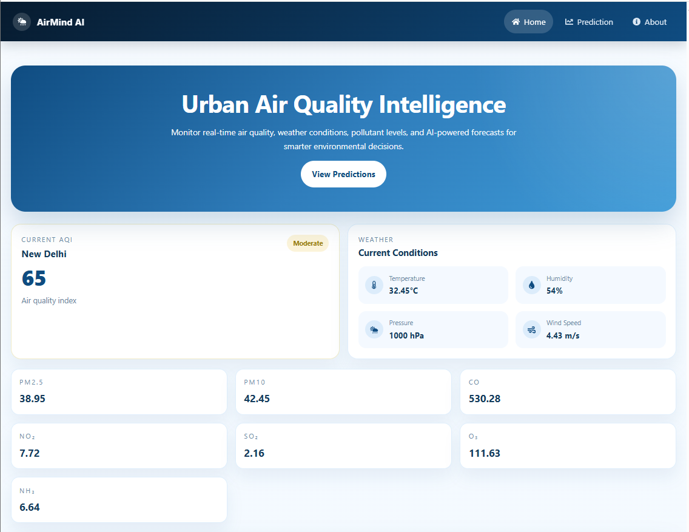
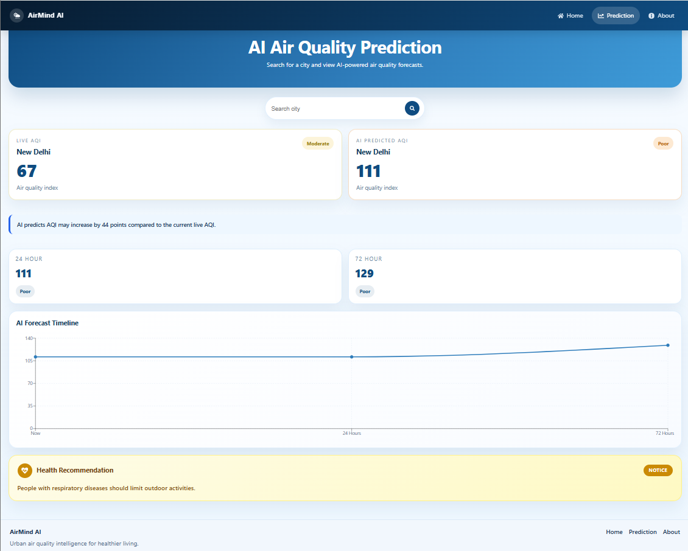
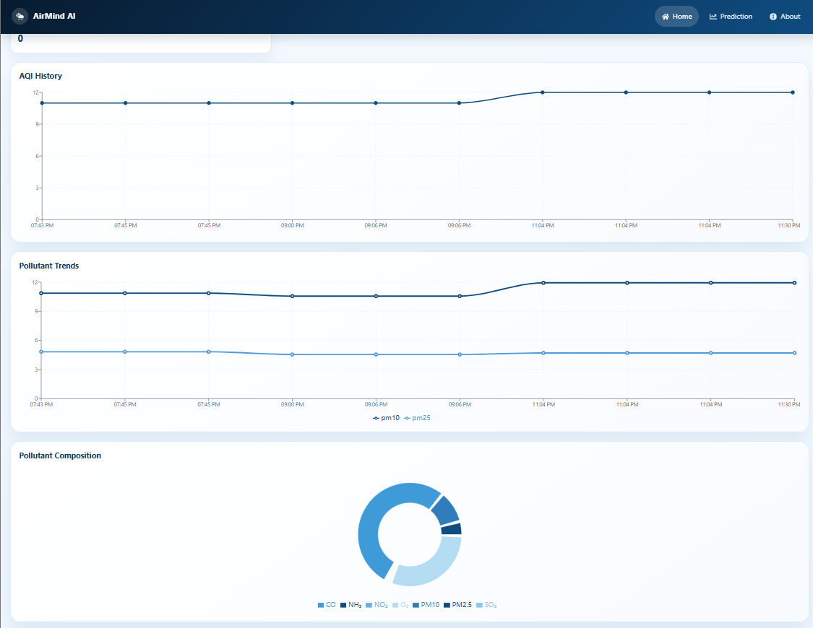
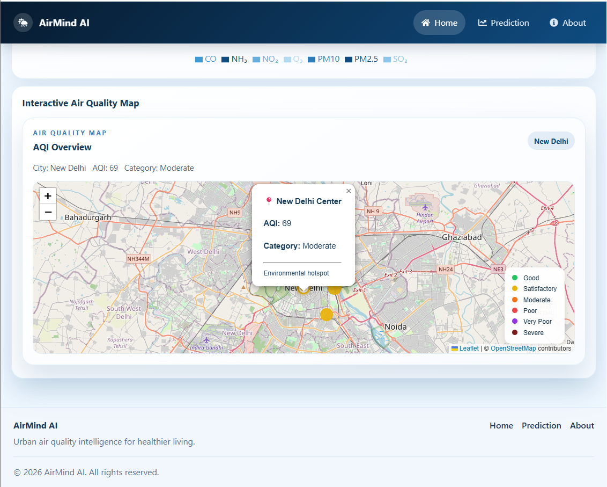

# AirMind AI — React Frontend 💻📱

> Interactive Urban Air Quality Intelligence Dashboard built with React 19, Vite, Leaflet, and Recharts. Developed for the ET AI Hackathon 2026.

[](https://react.dev)
[](https://vitejs.dev)
[](https://reactrouter.com)
[](https://leafletjs.com)
[](https://recharts.org)

---

## 💻 Frontend Overview

The **AirMind AI Frontend** is an intuitive, responsive React web application designed to deliver real-time environmental awareness, interactive spatial visualizations, and predictive air quality insights to citizens and smart city decision-makers.

Built on **React 19** and powered by **Vite**, the client handles dynamic city-based state updates, communicates asynchronously with the FastAPI backend via Axios, and renders real-time AQI gauges, interactive Leaflet maps, Recharts analytics, multi-horizon prediction cards, and tailored public health recommendations.

---

## 🌟 Features

- 📊 **Responsive Dashboard**: Unified layout providing quick-glance ambient AQI metrics, weather cards, and pollutant breakdown.
- 🟢 **Live AQI Visualization**: Real-time AQI gauge and status indicator categorized by international health safety bands.
- 🗺️ **Interactive Maps**: Geospatial mapping using Leaflet and React Leaflet for spatial awareness of monitoring stations and pollution hotspots.
- 📈 **AQI Trends & Analytics**: Time-series charts visualizing historical AQI records and trendlines using Recharts.
- 🧪 **Pollutant Breakdown**: Breakdown charts for individual toxic pollutants (`PM2.5`, `PM10`, `NO2`, `SO2`, `CO`, `O3`).
- 🤖 **AI Prediction Visualization**: Displays machine learning estimation outputs for current AQI alongside 24-hour and 72-hour forecast projections.
- 🌤️ **Weather Information**: Displays localized meteorological attributes (temperature, humidity, wind speed).
- 🏥 **Health Recommendations**: Auto-renders actionable health advisories based on current and predicted AQI categories.
- 🔍 **City Search & Context**: Global city selector enabling instant switching between monitored smart cities.
- 🎨 **Modern Responsive UI**: Clean design system built with custom CSS, supporting seamless viewing across desktop, tablet, and mobile devices.

---

## 🛠️ Technology Stack

| Layer / Library | Technology | Purpose |
| :--- | :--- | :--- |
| **Framework** | **React 19** | Modern component-based UI framework |
| **Build Tool** | **Vite** | Next-generation frontend tooling and instant HMR dev server |
| **Routing** | **React Router DOM** | Client-side page navigation (`/`, `/prediction`, `/about`) |
| **HTTP Client** | **Axios** | Asynchronous HTTP request client for consuming backend REST APIs |
| **Geospatial Mapping** | **Leaflet & React Leaflet** | Interactive map layers, custom markers, and tile rendering |
| **Data Visualization** | **Recharts** | Dynamic SVG line charts, area charts, and pollutant bar graphs |
| **Iconography** | **React Icons** | Clean vector icon sets (`FontAwesome`, `Lucide`, etc.) |
| **Styling** | **Custom CSS** | Modular, responsive styling without external utility overhead |

---

## 📂 Folder Structure

```text
frontend/
├── public/               # Public static assets, favicon, and map tiles
├── src/
│   ├── assets/           # Application images, logos, and global styles
│   ├── components/       # Reusable UI components
│   │   ├── Cards/        # AQI, Weather, and Prediction card widgets
│   │   ├── Charts/       # Recharts trend wrappers (AQIHistory, PollutantTrend)
│   │   ├── Layout/       # Navigation Bar and Footer components
│   │   └── Maps/         # Interactive Leaflet map wrappers
│   ├── context/          # Context API state management (CityContext.jsx)
│   ├── pages/            # View pages (Home.jsx, Prediction.jsx, About.jsx)
│   ├── services/         # Axios API client functions (aqiService.js, predictionService.js)
│   ├── App.jsx           # Root layout component & providers
│   └── main.jsx          # React DOM entrypoint & router initialization
├── package.json          # Node.js dependencies & scripts
├── vite.config.js        # Vite configuration settings
└── README.md             # Frontend documentation
```

---

## 🔄 Application Flow

The frontend architecture follows a unidirectional data flow from user interaction to backend fetch and DOM update:

```text
User Action (Select City / Load Page)
                 ↓
             React UI
                 ↓
         Axios API Client
                 ↓
          FastAPI Backend
                 ↓
         JSON API Response
                 ↓
        CityContext Update
                 ↓
      Dashboard & Map Update
```

---

## 🗺️ Routing

The application uses **React Router DOM** for client-side navigation between three core pages:

| Path | Page | Description |
| :--- | :--- | :--- |
| `/` | **Home Page** | Primary operational dashboard displaying live AQI, weather metrics, interactive map, and historical pollutant charts. |
| `/prediction` | **Prediction Page** | Dedicated AI forecasting interface displaying 24h & 72h predicted trends and personalized health advisories. |
| `/about` | **About Page** | Educational overview of AirMind AI, problem statement, smart city mission, system architecture, and team credentials. |

---

## ⚡ State Management

State management across the application is driven by React's native **Context API**:

- **`CityContext`**: Holds the currently active city selection (e.g., *"Hyderabad"*), coordinates, and active unit preferences.
- **Global Availability**: Allows the `Navbar` city search input, `Home` dashboard widgets, `Prediction` forecaster, and `Map` view to synchronize automatically whenever the selected city changes, eliminating prop drilling.

---

## 🔌 API Integration

The frontend uses an **Axios** service layer (`src/services/`) to communicate with the FastAPI backend running at `http://localhost:8000`.

- **Asynchronous Requests**: Service methods trigger asynchronous `GET` and `POST` calls to fetch current AQI, historical series, and multi-horizon prediction payloads.
- **Graceful Loading & Error States**: Built-in state handlers ensure loading spinners and fallbacks display during network latency or API errors.

---

## 🚀 Installation & Setup

### Prerequisites
- **Node.js 18.0** or higher
- **npm** (Node Package Manager)
- Running **AirMind AI FastAPI Backend** (on `http://localhost:8000`)

### 1. Install Dependencies

Navigate to the `frontend/` directory and install required npm packages:

```bash
cd frontend
npm install
```

### 2. Run Development Server

Start the local Vite development server with Hot Module Replacement (HMR):

```bash
npm run dev
```

The Vite dev server will start locally at:

👉 **`http://localhost:5173`**

---

## 📦 Build & Production

To compile the React application for production deployment:

```bash
npm run build
```

This creates an optimized, bundled build directory in `dist/`.

To preview the production build locally:

```bash
npm run preview
```

---

## 📸 Screenshots

| Home Dashboard | Prediction Dashboard |
| :---: | :---: |
|  |  |

| AQI Analytics | Interactive Map |
| :---: | :---: |
|  |  |

---

## 🔮 Future Improvements

- 🌙 **Dark Mode Support**: Toggleable dark theme for low-light dashboard viewing.
- 📱 **Progressive Web App (PWA)**: Add service worker caching for PWA installation on desktop and mobile.
- 💾 **Offline Data Caching**: Cache recent AQI readings in `localStorage` for offline access.
- 📱 **Native Mobile Companion**: React Native companion app for cross-platform iOS & Android mobile widgets.
- 🎛️ **Advanced Analytics Filters**: Date range pickers and customizable pollutant threshold filters.
- 🏙️ **Multi-City Comparison View**: Side-by-side split screen view for comparing AQI metrics across multiple cities.

---

<div align="center">

**AirMind AI Frontend • ET AI Hackathon 2026**

*React 19 • Vite • Leaflet • Recharts • Axios • CSS*

</div>
